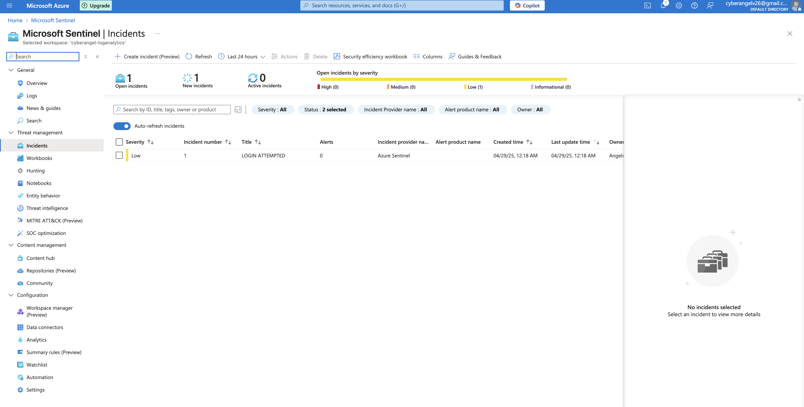
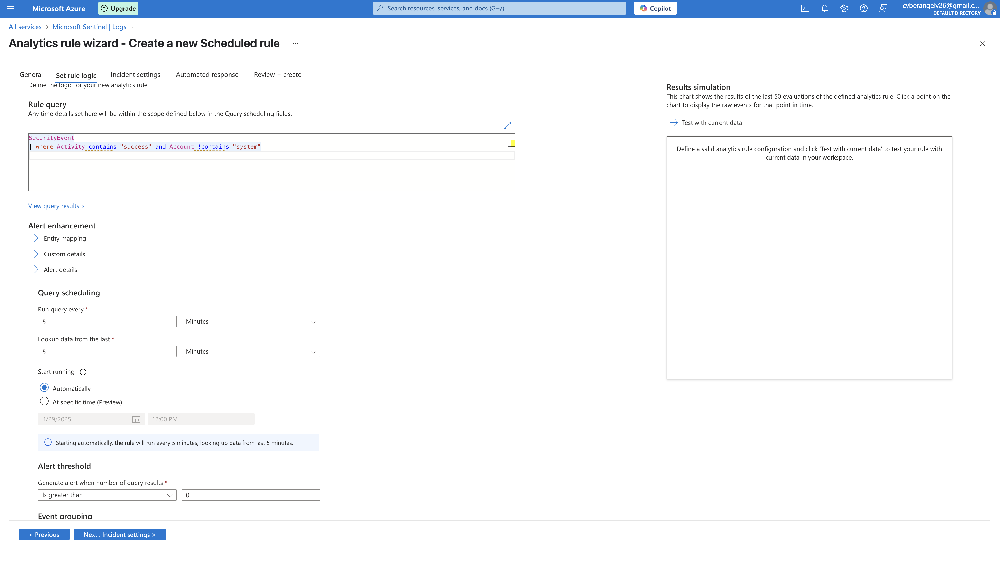

# 🚀 Cyber Angel's Portfolio of Cyber Security Projects

---

## Welcome to **Cyber Angel's Cybersecurity Portfolio**  
_A showcase of my professional cybersecurity skills, projects, and learning journey._  

View on [GitHub](https://github.com/AngelV-26)

---

# 🛡️ About Me
Hi, I'm Angelo — a cybersecurity enthusiast with over 10 years of IT experience, specializing in:

- Identity & Access Management (IAM)
- Application Security Testing (DAST)
- Risk Management and Compliance (SOX, NIST, FFIEC)
- MFA Implementation (Okta, YubiKey)
- Python Scripting (In Progress)
- Cloud Security Fundamentals (Entra ID, Conditional Access)

I'm passionate about security, continuous learning, and protecting critical systems.

---

# 📚 Featured Projects

#1. # Azure SIEM Monitoring Lab

# Project Overview
This project demonstrates how I deployed and configured Microsoft Sentinel (Azure SIEM) to monitor a Windows Virtual Machine (VM) for real-time security events hosted on Azure.

# Technologies Used
- Microsoft Sentinel (Azure SIEM)
- Azure Virtual Machine (Ubuntu/Windows)
- Azure Log Analytics
- Security Event Monitoring (Syslog / Windows Event Logs)
- KQL (Kusto Query Language) for threat hunting

# Project Objectives
- Deploy an Azure Log Analytics workspace
- Connect the VM to the workspace for security event collection
- Deploy and configure Microsoft Sentinel
- Build analytic rules and alerts
- Create dashboards for threat visibility
- Test alerts with simulated attacks (e.g., failed login attempts)

# Key Features
- Real-time monitoring of VM login activities
- Custom alerts for suspicious behavior
- Dashboard visualization of critical security events
- Automated incident creation and notification setup

# Screenshots
 1. Sentinel Overview

2. Active Alerts

3. Log Query Example (KQL)

SecurityEvent
[| where Activity contains "success" and Account !contains "system"]

Advanced Multistage Attack Detection

Description: 
"Microsoft Sentinel uses Fusion, a correlation engine based on scalable machine learning algorithms, to automatically detect multistage attacks by identifying combinations of anomalous behaviors and suspicious activities that are observed at various stages of the kill chain. Based on these discoveries, Azure Sentinel generates incidents that would otherwise be very difficult to catch. By design, these incidents are low-volume, high-fidelity, and high-severity, so this detection is turned ON by default."

---

## 2.# 🔐 Python Password Rotation Script

Welcome to my cybersecurity automation project!

This Python script generates secure, random passwords for privileged accounts and simulates vault storage using timestamped files. It demonstrates key principles of PAM (Privileged Access Management) and is a great introduction to automation in identity security.

---

## 📂 Features

- Random password generation using `secrets` and `string`
- Vault simulation folder with auto-generated `.txt` files
- Timestamped output for rotation tracking
- Simple to expand: encryption, logging, or API integration

---

## 💡 Technologies Used

- Python 3
- `secrets` + `string` for password generation
- File handling with `os` and `datetime`

---

## 📸 Screenshots

[Screenshot](screenshots/Sentinel_Incident_Login_Attempt.png)
Each password is saved with the username and a timestamp, simulating a real rotation process.

---

## You can try it yourself! 

''bash
git clone https://github.com/angelv-26/python-password-rotation-script.git
cd python-password-rotation-script
python rotate_passwords.py
[View Project ➔](https://github.com/AngelV-26/python-password-rotation-script)

---

## 3. Entra ID Access Policy Lab (In Progres)
_Lab project on managing Conditional Access Policies, enforcing MFA, and setting least-privilege permissions inside Microsoft Entra ID (Azure AD)._  

Tools:Entra ID (Azure AD), Okta, YubiKey

[View Project ➔](https://github.com/YourGitHubUsername/Entra-ID-Lab)

---

# ✨ Skills Overview

- IAM Platforms: Okta, Azure AD (Entra ID)
- Application Security Testing: False Positive Analysis
- Security Compliance: SOX ITGC, PCI DSS, NIST 800-53
- Authentication Methods: Passwordless MFA (YubiKey), Conditional Access
- Programming: Python (Learning through DataCamp)
- Security Tools: Burp Suite, OWASP ZAP, Splunk

---

# 📈 My Learning Journey

> “Today can be your day, don't give up."

Currently expanding skills in:
- Python for cybersecurity automation
- API security testing
- Building dynamic security dashboards with Tableau

---

# 📜 Certifications and Training

- DataCamp: Python Programming Track (In Progress)
- OWASP Top 10 Web Application Security (Self-Study Completed)
- Security+ Certification (In Progress)

---

# 📝 Contact Me

- LinkedIn:[Your LinkedIn](https://www.linkedin.com/in/angelo-vasquez/)
- GitHub: [Your GitHub](https://github.com/AngelV-26/CyberAngelsPortfolio)
- Email: Angelo.vasquez0826@gmail.com

---

# 🖼️ Small Image

---

# 🖼️ Large Image

---

# 📋 Lists

Unordered list:
- Cybersecurity Enthusiast
- Identity Defender
- Future Ethical Hacker

Ordered list:
1. Learn every day
2. Build real-world projects
3. Help organizations stay secure

---

# 📖 Quick Definitions

Name: Angelo V 
Born: In the world of technology  
Passion: Cybersecurity, Identity, Access Management  
Motto: Learn, Protect, Empower

---

# ➖ Horizontal Rule

---

# ✅ Final Section

Thank you for visiting my portfolio!  
I look forward to connecting, learning, and growing in the cybersecurity field.

